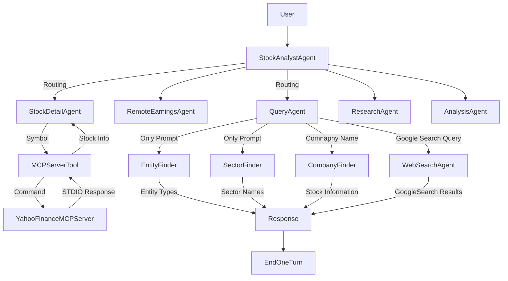
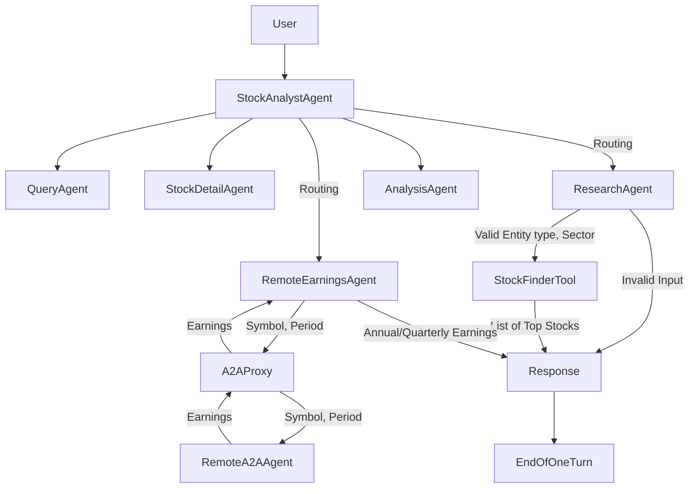
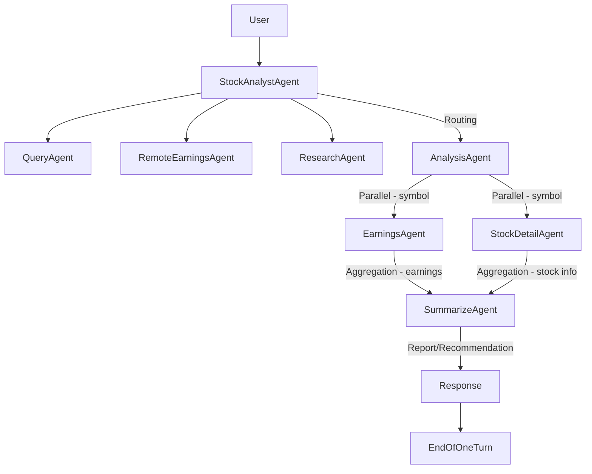

# Stock Analysis Application using Google ADK Framework and Yahoo Finance MCP server.

## The project is the Capstone project for Google/Kaggle 5-day AI Agent Intensive on-line course during Novemeber 10 - 14, 2025.


### Section: Objective and Business benefits.
To create a financial investment chatbot to make novice investors better informed with latest financial information using Yahoo Finance. Encouragingly, as investment community gets bigger with infusion of younger people, such chatbot is becoming increasinly popular to the community instead of going through investment advisors.
Though news and up-to-date information about financial markets are readily avaiable from Yahoo or other web-sites, this chatbot provides LLM-based interactions with Yahoo Finance server using both API and MCP based tools and agents. Additionally, user may also use this app to search Web for other topics/news using their favorite Google Search tool.

**DISCLAIMER**: This application is NOT intended to replace sound financial advice and guidance from certified investment professionals. Hence, author does NOT recommend anyone making any buy/sell investment decisions solely based on responses/recommendations by this chat-bot.


### Section: Main features
* Search
  * List of Entity Types (growth_companies, performing_companies, etfs, etc.).
  * List of Sector Names (technology, financial-services, utilities, real-estate, healthcares, etc.).
  * Company Symbol and Exchange traded - only one(1) company listing (mostly equity) returned.
  * Web Search using 'GoogleSearch' ADK tool.
* List of top companies for given 'Entity Type' and 'Sector' based in YTD earnings - up to 20 allowed.
* Details of Stock given Symbol or Ticker.
* Research and Summarize for Recommendation given Company Symbol/Ticker.
  * Sequential Agent: ParallelAgent, followed by SummarizeAgent
    * ParallelAgent: To gather Earnings and Stock Details in parallel
      * Uses Local Earnings Agent (Disclaimer: Unable to get results from Remote A2A Agent)
      * Uses Stock Details Agent.
    * SummarizeAgent: Summarize and Recommend based on Earnings and Stock Details received from two(2) parallel agents. 
* Earnings details for given Symbol and Period (annual/quarterly) using Remote A2A Earnings Agent. Remote A2A Agent Server setup is required. Github provides code.
* Details of a Stock given Symbol/Ticker. This uses Yahoo MCP Server obtained from Github: 

### Section: Agent/Tool Flow diagram

#### Routing Agent with (1) Query Agent and (2) StockDetail Agent (MCPServerTool)


#### Routing Agent with (3) Remote A2A Earnings Agent and (4) Research Agent



#### Routing Agent with (5) Analysis/Recommendation Agent using Local Earnings Agentt and StockDetail (MCP) Agent




### Section: Sample Test scenarios/cases with possible prompts.

|Feature|Agent Name|Agent/Tool/MCP|Sample Prompt|Expected Results|
|-------|----------|--------|-------------|---------------|
|Search|QueryAgent|Stock Finder Tool|Find symbol of Company Intel Corporation|Symbol and Exchange Traded|
|Recommendation|AnalysisAgent|LocalEarnings, StockDetail and Summarize Agents(3)|Research and Summarize stock symbol NVDA|earning details, stock details, followed by short summary and mild recommendation|
|Stock Detail|ResearchAgent|Stock Finder/Error Tool|Find top 10 stocks for entity type performing_companies and sector healthcare order by ytd return. Your response should list company name, industry, symbol, exchange, YTD return in Tabular format. Convert YTD Return as Percentage up to 2 decimals|list of stocks with performance summary|
|Sector Research|StockDetailAgent|Yahoo MCP Tool|Find details of stock GOOG|details of Alphabet stocks with recent performance|
|Company Earnings|RemoteEarningsAgent|A2A Remote Server/Agent|Find quarterly earnings of symbol 'AAPL'|quarterly earnings (past 5 quarters)|
|Search|QueryAgent|Entity Finder Tool|Find list of entity types|Static list: etfs, mutual_funds, companies, growth_companies, performing_companies|
|Search|QueryAgent|Sector Finder Tool|Find list of sectorss|Static list: basic-materials, communication-services, consumer-cyclical, consumer-defensive, energy, financial-services, healthcare, industrials, real-estate, technology, utilities|
|Search|WebSearchAgent|GoogleSearch Tool|Get top Political news in the USA today|<span style="color: red;">**NOTE: the LLM Haulicinated showing POTUS Trump as 'Former' POTUS Trump**</span>|
______________________________________________________________________
* Note: for other test cases, please refer to the Eval Json.


### Section: Logging and Observability
* Logging: Python 'logger' using Rotating File handlers (configured for 10 files of 100kb each) 
* Observability: Custom 'PlugIn' from ADK 'LoggingPlugin' base class. Plug-in was registered using custom 'App' instance.
  * Note: Callbacks added, but it seems was not invoked using from 'adk web' or 'adk run'.


### Section: Testing and Evaluation
* Evals using 'adk web' UI were captured and verified.
  * Note: Often 'Run Evaluation' process failed to record anything.

* **While Testing from ADK CLI and WEB, below ADK Errors were noted:**
  * File "venv/lib/python3.12/site-packages/google/adk/tools/agent_tool.py", line 169, in run_async.     merged_text = '\n'.join(p.text for p in last_content.parts if p.text)
  * File "venv/lib/python3.12/site-packages/google/adk/evaluation/local_eval_service.py", line 224, in _evaluate_single_inference_result  if eval_case.conversation_scenario is None and len(). TypeError: object of type 'NoneType' has no len()


### Section: Technical Details
* Environment
  * Ubuntu 22.04 LTS Linux using Windows 10 WSL 2
* **LLM Model**
  * Dev/Testing: Gemini-2.5-Flash-lite
  * Integration/Production: Gemini-2.5-Flash
    * Note: Model Haulicination/Incapabilities with the 'Flash-lite' Model were observed:
      * For some user queries, 'Root Agent' failed to properly routing to appropriate Agent based on user query.
      * For some Tools, in/out Parameter parsing failed. 
* Output Schema: based on Pydantic model for some Tools.
* **Agent Memory management**
  * ADK WEB default 'InMemorySessionService' was used for Dev testing.
  * SQLLite database using as 'DatabaseSessionServer' passing '--memory_service_uri' and --session_db_url to 'adk web' command.
  * (TBD) Vertex AI MemoryBank integration was done; however MemoryBank was not tested much.
* GitHub Source Codebase:
  * https://github.com/schakrab02/aiagent-st-fsi/tree/main


### Section: Development/Integration Testing Environment
* ADK CLI (adk run)
* ADK WEB (adk web)


### Section: Production Deployment
* Vertex AI Agent Engine - deployment using 'adk deploy agent_engine'.
  * Linux script to check server and delete server provided.
  * Note: Application would not get deployed with 1 cpu and 1Gi. Deployed after .agent_engine_config.json was configured with 4 cpu and 8Gi.
* Remote A2A Agent
* Yahoo Finance Server (for API-based call)
* Yahoo Finance MCP using command/npx (for MCP tool use)
  * Developmengt testing using: MCP Inspector with Auth Bearer Token from npx command below.
    * Installation
  ```shell
  #!/bin/sh
  pip install yfinance
  pip install yahoo-finance-server
  yahoo-finance-server ## basic, w/o proxy
  npx @modelcontextprotocol/inspector yahoo-finance-server  ## npx w/p r
  ```

#### Production testing in Vertex Ai Agent Engine UI - **without setting Yahoo MCP Server and Remote A2A Agent, only below may be checked out.**
|Feature|Agent Name|Agent/Tool/MCP|Sample Prompt|Expected Results|
|-------|----------|--------|-------------|---------------|
|Search|QueryAgent|Entity Finder Tool|Find list of entity types|Static list: etfs, mutual_funds, companies, growth_companies, performing_companies|
|Search|QueryAgent|Sector Finder Tool|Find list of sectorss|Static list: basic-materials, communication-services, consumer-cyclical, consumer-defensive, energy, financial-services, healthcare, industrials, real-estate, technology, utilities|
|Search|WebSearchAgent|GoogleSearch Tool|What's today's weather in Edison, NJ?|weather from GoogleSearch|
____________________


## **Acknowledgement and Credits**
* Kaggle and Google Teams for hosting this AI Agent intensive 5-day course for free of cost and offering valuable inputs in 'Discord' channels.
* Yahoo Finance Server for making their GitHub repo public.
  * Repo URL: <a href="https://github.com/AgentX-ai/yahoo-finance-server"> AgentX-ai (Author: RobinXL)</a>
* Blogs and Discussion Forums providing valuable insights of issues which were not easy to fix searching Google ADK documentation.
  * https://iamulya.one/posts/adk-runner-and-runtime-configuration/
  * https://google.github.io/adk-docs
  * https://github.com/google/adk-python/issues/3522


## License
* MIT Open License (2.0)


## **DISCLAIMER**
<span style="color: red;">**Author of the Application/Chatbot is NOT responsible for any financial or other losses that users may incur when taking any investment decisions based on any recommendation from this Application/Chatbot.**</span>

____________________________________________
##### End of this README.md version 1.0.
